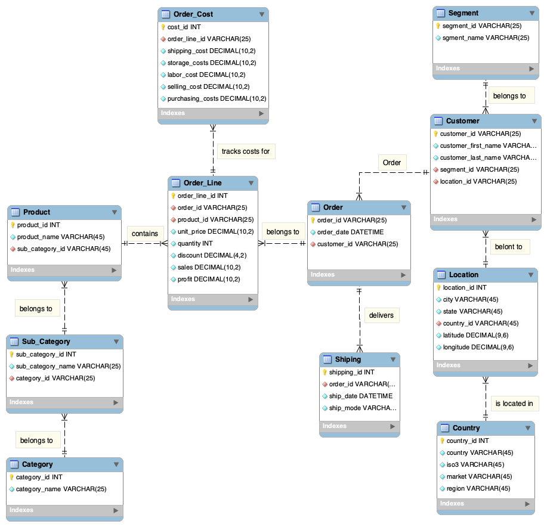

# Electronics Retail Database
## Project Overview

This academic project focuses on the design and implementation of a relational database for a simulated global electronics retail company.

The goal was to transform retail data into a structured relational database that supports the management and analysis of customers, products, orders, shipping, locations, and costs.

The project was developed using **MySQL Workbench** and includes EER modeling, database normalization, table creation, data implementation, relationships, constraints, and SQL queries for business analysis.

## Tools & Technologies

- MySQL
- MySQL Workbench
- SQL
- EER Modeling
- Relational Database Design
- Database Normalization

## EER Diagram

The EER model represents the relationships between customers, orders, products, shipping, locations, and order costs.

## Database Structure

The relational database includes the following main entities:

- Customer
- Segment
- Location
- Country
- Orders
- Shipping
- Order Line
- Product
- Category
- Sub-Category
- Order Cost

## Database Normalization

The database was designed following normalization principles. During the modeling process, a transitive dependency was identified in the location data, where country determined attributes such as ISO3, region, and market.

To improve the database structure, the country information was separated into a `Country` table and connected to the `Location` table through `country_id`.

## SQL Skills Demonstrated

- Database and table creation
- Primary and foreign keys
- One-to-many relationships
- Data insertion
- JOIN operations
- GROUP BY and aggregate functions
- Data type conversions
- CHECK constraints
- Business-oriented SQL queries

## Example Business Questions

The database can be used to answer questions such as:

- Which customers generate the highest total sales?
- Which products generate the highest sales?
- How are products organized by category and sub-category?
- What costs are associated with individual order lines?

## Dataset

The dataset represents a simulated global electronics retail business and was used for academic purposes. It does not contain real company or customer data.

## Project Files

- `electronics_retail_database.sql` — MySQL database creation, data implementation, constraints, and queries.
- `electronics_retail_data.xlsx` — Simulated electronics retail dataset.
- `electronics_retail_eer_diagram.png` — EER diagram showing the relational database structure.
